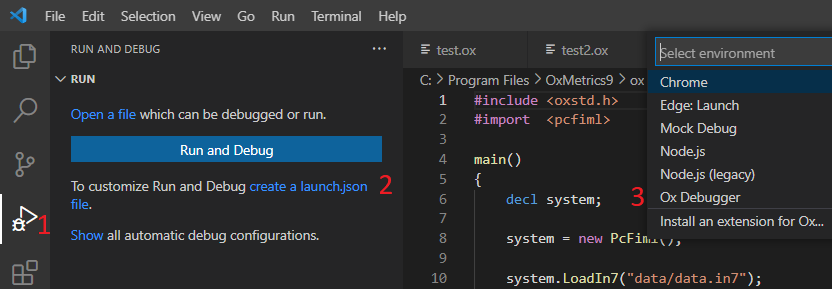

# Debugger 

This is an experimental feature. 

First, please read [Debugging](https://code.visualstudio.com/docs/editor/debugging) for an overview of debugging support in VsCode.

## Quick Start

Requirements: OxMetrics 9 is required. 

A launch.json file has to be created in order to debug an ox file. 

To create it: click the *create a launch.json* file link in the Run start view and select *Ox Debugger*

    
A file with a content similar to what follows will be generated : 
       
        {
            "version": "0.2.0",
            "configurations": [
                {
                    "name": "Debug",
                    "type": "oxd",
                    "request": "launch",
                    "oxdpath": "${command:extension.ox.GetDebuggerPath}",
                    "target": "${file}",
                    "cwd": "${fileDirname}",
                    "showOxOutput": true
                }
            ]
        }

Next to debug your ox file, start your debug session with `F5`. 
  

## Development

For an overview of the debug adapter protocol see [What is the Debug Adapter Protocol ?](https://microsoft.github.io/debug-adapter-protocol/overviews)

To debug the debbuger extension, launch the Debug Server and use the following Launch file. 

  
    {
        "version": "0.2.0",
        "configurations": [
            {
                "name": "Launch Program",
                "type": "oxd",
                "request": "launch",
                "oxdpath": "${command:extension.ox.GetDebuggerPath}",
                "target": "${file}",
                "cwd": "${fileDirname}",
                "showOxOutput" : true,
                "debugServer": 4711,
                "showDevDebugOutput": true
            }
        ]
    }